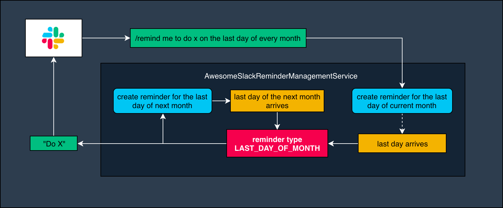

# Last day of every month reminder
Dear Slack. Your reminder functionality is great. It would be even greater if it had the possibility to set the reminder for last day of every month.  
  
There are many activities that must be done on the very last day of each month, such as marking the amount hours worked to a time tracking system, and having a Slack reminder for such activities would improve the working routines of numerous people.  
  
